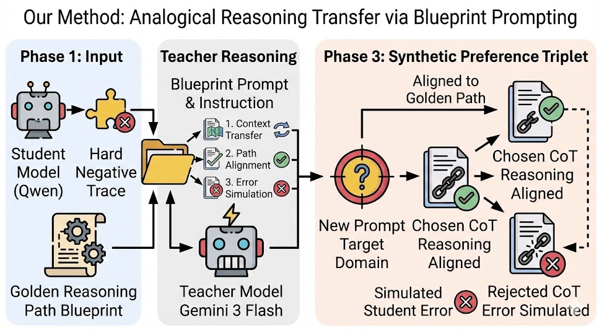
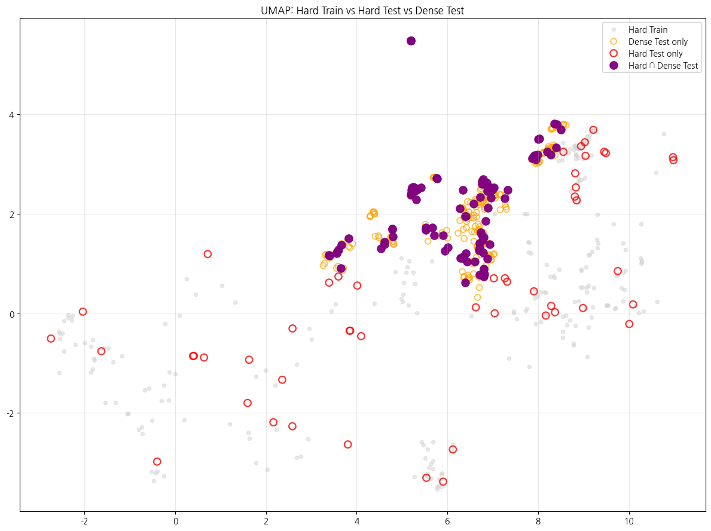

# Reasoning Distillation via Analogical Reasoning Transfer
<div align="center">

[](https://www.python.org/)
[](https://huggingface.co/docs/transformers/)
[](https://arxiv.org/abs/2403.07691)
[](https://hydra.cc/)
[](https://github.com/unslothai/unsloth)

</div>

## Project Overview

본 프로젝트는 **Naver Boostcamp AI Tech 8기** 과정의 일환으로 수행되었다.
KMMLU, 수능형 문제, KLUE MRC 등 **고난이도 다단계 추론 문제**에서 Qwen3 시리즈 모델의 성능 한계를 분석하고,
이를 개선하기 위한 방법으로 **Reasoning Distillation via Analogical Reasoning Transfer**를 제안한다.

본 접근은 정답이나 지식 자체를 증류하는 것이 아니라,
**문제를 해결하는 추론 경로(Reasoning Path)를 정렬(alignment)하는 것**을 목표로 한다.

---
## TL;DR

### 1) Key result
- 200 ORPO Preference Pairs → Upstage 수능(425문항)에서 **+14문제(≈ +3.27%p)** 추가 정답  
- Qwen3‑14B‑ORPO가 **Qwen3‑30B‑A3B‑Instruct와 동급 또는 우수**한 과목별 성능 달성

### 2) 핵심 요약
- 입력: Teacher(Gemini‑3‑Flash)로부터 선별한 **Hard Negatives** (200개)  
- 방법: Teacher의 추론 경로 전이(Analogical Transfer) + ORPO로 Decision Boundary만 국소 정렬 (SFT 불필요)  
- 의미: 소수의 Preference 데이터로 도메인에 따라 성능 개선 가능

## Repository Architecture

본 프로젝트는 모노레포 구조로 구성되어 있으며, `feature/ver-3` 브랜치가 메인 허브 역할을 수행합니다.

| Module | 역할 | README |
|--------|------|--------|
| **seed-data** | 시드 문항 수집 및 Hard Negative 생성 | [상세 문서](./seed-data/README.md) |
| **preference-data** | Analogical Transfer 기반 데이터 증강 | [상세 문서](./preference-data/README.md) |
| **orpo-train** | ORPO 학습 파이프라인 (Hydra 설정) | [상세 문서](./orpo-train/README.md) |
| **eda** | train , test셋 EDA | [상세 문서](./eda/README.md) |
---
## Why Reasoning Alignment?

### Observed Issue

Qwen3 시리즈 모델은 단일 사실(fact)에 대한 질문에서는 높은 정확도를 보이지만,
여러 정보를 연결해야 하는 **복합 인과·단계적 추론 문제**에서는 일관되게 성능이 저하된다
(특히 한국사, 역사, 심리, 경제 계열 문제에서 두드러짐).

### Core Insight

2025년 기준 LLM은 이미 충분한 지식을 보유하고 있다.
문제는 *무엇을 아는가*가 아니라, **그 지식을 어떤 순서와 기준으로 연결하는가**이다.

> 즉, 성능 저하의 원인은 지식 부족이 아니라
> **추론 경로(Reasoning Path)의 정렬 실패**에 있다.

---

## Why Not SFT?

Supervised Fine-Tuning(SFT)은 가장 직관적인 해결책이지만,
이미 고도로 학습된 모델에는 다음과 같은 위험이 존재한다.

* **Distribution Collapse**: 소량 데이터로 인한 출력 분포 왜곡
* **Catastrophic Forgetting**: 기존 추론 능력 손실
* Thinking / Non-Thinking 하이브리드 모델에서 추론 품질 저하

따라서 본 프로젝트는 SFT 대신,
**기존 분포를 유지하면서 추론 경로만 선택적으로 정렬하는 방식**을 채택한다.

---

## Our Approach: Preference-based Reasoning Alignment

본 연구는 **ORPO(Odds Ratio Preference Optimization)** 기반 Preference Learning을 활용하여:

* 모델의 기존 분포를 보존하면서
* 올바른 추론 경로는 강화하고
* 잘못된 추론 경로는 억제한다

### Key Components

1. **Hard Negative Mining**
   Teacher는 성공했으나 Student는 실패한 문제만 선택적으로 사용

2. **Logical Structure Extraction**
   시드 문항에서 도메인 독립적인 추론 구조 추출

3. **Analogical Reasoning Transfer**
   추론 구조를 새로운 도메인·맥락으로 전이

4. **ORPO-based Alignment**
   Chosen / Rejected 간 Odds Ratio 최적화

---

### Hard Negative Mining


Teacher는 성공했으나 Student는 실패한 문항(Hard Negative)을 집중적으로 타겟팅하여:
1. Teacher의 성공적인 추론 경로(Golden Path)와 Student의 실패한 추론 경로(Failed Path) 추출
2. 도메인 독립적인 논리 구조 패턴 분석
3. 추출된 구조를 새로운 도메인/맥락으로 전이하여 증강 데이터 생성
4. ORPO로 Student 모델 학습

### Blueprint Prompting Strategy

Teacher에게 단순히 “비슷한 문제를 생성하라”고 요청하지 않는다.
대신, **성공한 추론 경로와 실패한 추론 경로를 함께 제공**하는
**Blueprint Prompting** 전략을 사용한다.

**Input**

* Golden Reasoning Path (Teacher의 성공 추론)
* Rejected Reasoning Path (Student의 실패 추론)
* Transfer Target (새 도메인/맥락)

**Output**

* 동일한 논리 구조를 유지한 새로운 문제
* 명확히 구분된 Chosen / Rejected 응답 쌍

이 방식은 정답 여부가 아니라
**추론 경로의 정렬 여부를 데이터 품질 기준으로 삼는다.**

---
#### 증강 데이터 예시

**추출된 논리 구조**: `정책 목적 → 구체적 수단` 간의 **인과성 추론**

<table>
<tr>
<td width="50%">

#### Original Seed
**흥선대원군의 서원 철폐 정책**

```
문제: 천여 곳의 서원을 철폐하고... 
      (가) 인물이 추진한 정책으로 
      옳지 않은 것은?

선지:
1. 경복궁을 중건하였다
2. 호포제를 실시하였다
3. 비변사를 강화하였다 [오답]
4. 통리기무아문을 설치하였다
```

**Chosen Reasoning (Teacher)**
```
1. 핵심 목적: 왕권 강화
2. 수단 분석:
   - 서원 철폐 → 지방 사림 세력 약화
   - 비변사는 신하 권력 강화 기구
3. 논리: 왕권 강화 정책에서
   비변사 강화는 모순
→ 답: 3번
```

**Rejected Reasoning (Student)**
```
1. 서원 철폐 = 유교 개혁
2. 정조도 유교 개혁 추진
3. 4번 통리기무아문은 근대 기구
4. 오판: 정조의 정책으로 착각
→ 오답: 4번
```

</td>
<td width="50%">

#### Augmented Data
**광종의 노비안검법**

```
문제: 노비들을 조사하여 원래 
      양인이었던 자들은 모두 해방...
      이 국왕에 대한 설명은?

선지:
1. 과거제를 실시하였다 [정답]
2. 지방에 12목을 설치하였다
3. 독서삼품과를 실시하였다
4. 청해진을 설치하였다
```

**Chosen Reasoning (Aligned)**
```
1. 핵심 목적: 호족 세력 견제
2. 수단 분석:
   - 노비안검법 → 호족 경제력 약화
   - 과거제 → 왕권 직속 관료 양성
3. 논리: 호족 견제 정책으로
   과거제가 일치
→ 답: 1번
```

**Rejected Reasoning (Simulated)**
```
1. 노비 해방 = 지방 제도 개혁
2. 12목 설치도 지방 제도 정비
3. 성종과 광종 정책 혼동
4. 오판: 유사 시대 인물 착각
→ 오답: 2번
```

</td>
</tr>
</table>

**전이 포인트 분석**

- **논리 구조 보존**: "정책 목적 → 구체적 수단"의 인과성을 검증하는 추론 패턴이 동일하게 유지된다.
- **오류 패턴 재현**: Student가 "유사 시대의 다른 인물"로 혼동하는 실수를 새로운 문제에서도 재현한다.
- **난이도 일관성**: 배경지식과 텍스트 추론의 균형이 원본과 동일하게 유지된다.
- **도메인 전이**: 조선 후기 → 고려 시대로 시대는 바뀌었지만, "왕권 강화"라는 정책 목적의 논리는 동일하다.
---
## Performance

### Evaluation Setup

**Models**
- Baseline (14B): Qwen3-14B-AWQ
- Baseline (30B): Qwen3-30B-A3B-f8
- Target (ORPO): Qwen3-14B-bnb-4bit-ORPO

**Dataset**
- Upstage 수능형 문제 869 문제 (test set)
- 총 869문항 중 `425개`의 `수능 기출문제`만 사용
- 정답 라벨: Gemini-3-Flash + GPT-5.2 각 3회 추론 후 다수결

**Key Result**

200개의 ORPO 학습 데이터만으로 **약 2배 큰 30B 모델과 동급 이상의 성능** 달성

---


| 과목 (Subject) | Qwen3-14b-AWQ | Qwen3-30b-A3b-Ins | Qwen3-14b-ORPO | 문항 수 (Support) |
| :--- | :---: | :---: | :---: | :---: |
| 국어 | 71.43% | **73.55%** | `73.55%` | 189 |
| 생활과 윤리 | 71.67% | 71.67% | `75.00%` | 60 |
| 윤리와 사상 | 70.77% | 67.69% | `73.85%` | 65 |
| 사회문화 | 58.33% | **68.75%** | 64.58% | 48 |
| 정치와 법 | 57.14% | **60.32%** | 58.73% | 63 |

> 실제 대회 test set의 경우 orpo 적용 후 f1-score가 소폭 하락 하였으나 앞서 개선하고자 했던 유형인 
> test set에 있는 실제 수능 기출문제 425문항을 기준으로 하면 성능이 유의미하게 향상됨을 확인했다.
> **단 200개의 데이터로도 도메인 맞춤 reasoning alignment가 가능함**을 확인했다.

---
### Data Distribution Analysis [Umap Visualization]

시각화 결과, UMAP 시각화에서 Hard Training Data가 수능 기출문항과 높은 중첩을 보였다.

즉, Hard Mining으로 구축한 데이터가 수능 문항의 잠재적 추론 공간(Latent Space)과 매우 유사했기 때문에, 단 200개의 Preference Dataset 만으로도 강력한 도메인 정렬이 가능했던 것으로 보인다.

## Key Findings

* Hard Negative만 학습하는 것이 전체 데이터보다 효율적
* 논리 구조만 보존하면 도메인이 달라도 추론 패턴 전이 가능
* Blueprint Prompting이 데이터 품질을 결정적으로 개선
* ORPO는 reasoning alignment에 안정적으로 작동

---

## Technical Stack

```yaml
Models:
  Teacher: Gemini-3-Flash
  Student Base: Qwen3-235B
  Student Target: Qwen3-14B

Training:
  Algorithm: ORPO (Odds Ratio Preference Optimization)
  Framework: Unsloth + 🤗 Transformers + bitsandbytes (bnb-4bit)
  Hardware: V100 32GB × 1
  Training Time: ~4 hours

Data:
  Source: KSAT-style questions (Upstage)
  Seed: ~200 Hard Negatives (Teacher ✓ / Student ✗)
  Augmentation: Blueprint Prompting + Analogical Transfer

Evaluation:
  Metrics: Accuracy, F1, Subject-wise analysis
```
---
## References
- [ORPO: Monolithic Preference Optimization](https://arxiv.org/abs/2403.07691)
- [Qwen Technical Report](https://arxiv.org/abs/2309.16609)
- [Chain-of-Thought Prompting](https://arxiv.org/abs/2201.11903)
- [Self-Rewarding Language Models](https://arxiv.org/abs/2401.10020)
- [Analogical Reasoning in Large Language Models](https://arxiv.org/abs/2310.01714)
