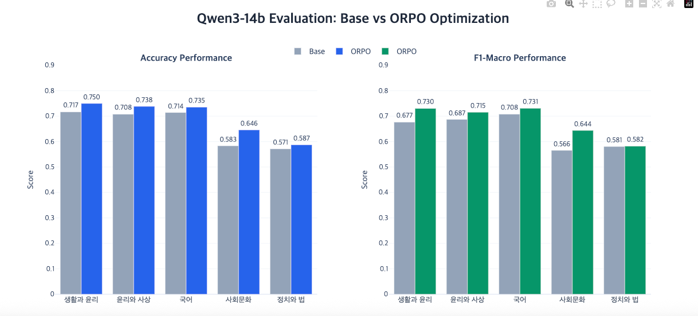
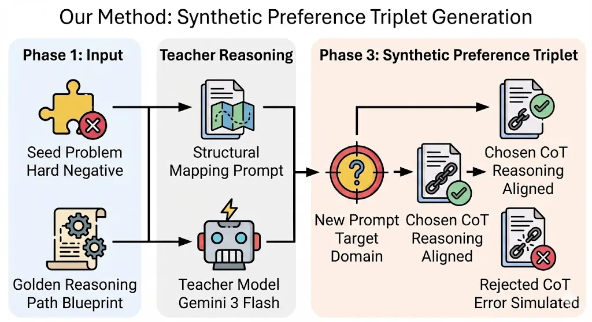

# Reasoning Distillation via Analogical Reasoning Transfer

> 네이버 부스트캠프 AI Tech 8기 Project 2
수능형 문제 풀이 모델 생성을 위해 선택한
Reasoning Distillation 기반 추론 

<div align="center">

[](https://www.python.org/)
[](https://huggingface.co/docs/transformers/)
[](https://arxiv.org/abs/2403.07691)
[](https://hydra.cc/)
[](https://github.com/unslothai/unsloth)

</div>


---

## Project Overview
본 프로젝트는 **Naver Boostcamp AI Tech 8기**의 일환으로 진행된 프로젝트 수행 결과입니다.
**KMMLU,수능형 문제,KLUE MRC** 데이터 등 다양한 고난이도 추론 문제에서 Qwen3 시리즈 모델의 추론을 개선하기 위해 **Reasoning Distillation via Analogical Reasoning Transfer**  를제안합니다.

## MAIN ISSUE
Qwen3 시리즈 모델이 공통적으로 train 데이터의 한국사,역사,경제 등 복잡하고 여러 단계의 추론이 요구되는 문제에서 낮은 성능을 보이는 문제를 발견했습니다.

## Core Philosophy 
2025년 현재, Qwen3와 같은 LLM 모델들은 이미 방대한 코퍼스를 학습하여 지식의 절대량 자체는 충분합니다. 그럼에도 불구하고 복잡한 인과 관계나 단계적 추론 문제에서 오답을 내는 경향을 보이는데,이는 모델이 보유한 파편화된 지식들을 정답으로 연결하는 Reasoning Path가 정교하게 정렬되지 않았기 때문입니다. 즉, 향후 LLM 정렬의 핵심은 새로운 지식의 주입이 아닌, 보유한 지식을 조합하는 '논리적 경로'의 최적화에 있다고 생각했습니다.

1. **지식이 아닌 추론 경로의 부재**

앞서 언급했듯,Qwen3 시리즈 모델은 이미 충분한 사전학습을 거쳤기 때문에, 지식의 절대량 측면에서는 부족함이 없습니다. 실제로 개별 사실(facts)에 대한 질문에는 높은 정확도를 보입니다. 그러나 여러 정보를 연결하고, 인과관계를 추론하며, 논리적 모순을 식별해야 하는 복잡한 문제에서는 실패합니다.

이는 무엇을 아는가(What to know)가 아니라 어떻게 생각하는가(How to think)의 문제입니다. 모델이 파편화된 지식을 적절한 순서로 연결하고, 올바른 판단 기준을 적용하는 추론 경로(Reasoning Path)가 정렬되지 않았기 때문입니다.

2. **SFT의 한계**
가장 직접적인 해결 방법은 Supervised Fine-Tuning(SFT)으로 정답 데이터를 추가 학습시키는 것입니다. 그러나 이미 고도로 학습된 모델에 SFT를 적용하면 다음과 같은 위험이 있습니다:

1. **Distribution Collapse**: 적은 양의 SFT 데이터로 인해 모델의 원래 출력 분포가 왜곡되고, 특정 패턴에 과적합될 수 있습니다.
2. **Catastrophic Forgetting**: 새로운 데이터 학습 과정에서 기존에 학습된 능력이 손상될 수 있습니다. 특히 Thinking과 Non-Thinking 하이브리드 모델의 경우, 추론 능력이 저하될 위험이 큽니다.

**이번 솔루션의 접근: Reasoning Path Alignment via Preference Learning**
기존의 Knowledge Distillation이 Teacher의 지식을 압축하여 전달하는 것에 집중했다면, 이 솔루션은 **추론 과정 자체를 학습**시키는 것을 목표로 합니다. SFT 대신 **ORPO(Odds Ratio Preference Optimization)**를 활용하여:

- **모델의 기존 분포를 보존**하면서도
- **올바른 추론 경로는 강화**하고
- **잘못된 추론 경로는 억제**하는
방식으로 안전하게 정렬합니다.

**핵심 전략**
1. **Hard Negative Mining**: Teacher는 성공했으나 Student는 실패한 문항 집중 타겟팅
2. **Logical Structure Extraction**: 시드 문항에서 도메인 독립적인 추론 패턴 추출
3. **Analogical Transfer**: 추출된 논리 구조를 새로운 도메인/맥락으로 전이
4. **ORPO-based Alignment**: Odds Ratio Preference Optimization으로 Decision Boundary 정렬

이를 통해 단순히 '정답'을 외우는 것이 아니라, Teacher가 문제를 해결하는 '사고 방식'을 Student가 체득하도록 합니다.

---

## Performance

### Evaluation Results

**평가 모델**: Qwen3-14B  
**평가 데이터**: Upstage 제공 수능 문제 테스트셋 (총 425문항)


200개의 ORPO 학습 데이터로 **Qwen3-14B**가 **14문제를 추가로 해결**

| 과목 | 문제 수 | Base 정답 | ORPO 정답 | 추가 해결 | Accuracy | F1 Score |
|------|:-------:|:---------:|:---------:|:---------:|:--------:|:--------:|
| **생활과 윤리** | 60 | 43 | **45** | **+2** | 71.67% → 75.00% | 67.65% → 73.03% |
| **윤리와 사상** | 65 | 46 | **48** | **+2** | 70.77% → 73.85% | 68.73% → 71.54% |
| **국어** | 189 | 135 | **139** | **+4** | 71.43% → 73.55% | 70.79% → 73.09% |
| **사회문화** | 48 | 28 | **31** | **+3** | 58.33% → 64.58% | 56.56% → 64.39% |
| **정치와 법** | 63 | 36 | **37** | **+1** | 57.14% → 58.73% | 58.07% → 58.22% |
| **평균** | 425 | 288 | **302** | **+14** | 67.76% → 71.06% | 64.36% → 68.06% |

<!-- **상세 분석**: [`eda`](../../tree/eda) 브랜치에서 문제 유형별 성능 분석 및 시각화 확인 -->
---

## Repository Architecture

본 프로젝트는 **모노레포 구조**로 설계되었습니다. 각 모듈은 독립적인 실험 단계를 담당하며, 재현성과 유지보수를 위해 명확하게 분리되어 있습니다. `feature/ver-3` 브랜치가 전체 파이프라인을 포함하는 메인 브랜치 역할을 수행합니다.

### Module Overview

| Module | 역할 | README |
|--------|------|--------|
| **seed-data** | 시드 문항 수집 및 Hard Negative 식별 | [상세 문서](./seed-data/README.md) |
| **preference-data** | Analogical Transfer 기반 데이터 증강 | [상세 문서](./preference-data/README.md) |
| **orpo-train** | ORPO 학습 파이프라인 (Hydra 설정) | [상세 문서](./orpo-train/README.md) |
| **eda** | 성능 분석 및 오류 케이스 연구 | [상세 문서](./eda/README.md) |

## Methodology

### Phase 1: The Pivot - 전략 전환의 배경

본 연구는 초기 가설의 실패를 통해 더 효과적인 접근법을 발견한 과정을 포함합니다. 이 Pivot 과정은 단순한 실패가 아닌, **왜 특정 방법론이 작동하지 않는지**에 대한 심층적 이해를 제공합니다.

#### 초기 시도: Self-Rewarding Iterative ORPO

**초기 가설**

Qwen3-235B와 80B,32B,14B는 동일한 모델 패밀리로, 유사한 출력 분포를 가진다고 가정했습니다. 따라서 235B 모델을 Iterative하게 활용하여 자체 생성한 응답을 기반으로 Preference 데이터를 구축하고, 이를 통해 14B 모델을 점진적으로 정렬시킬 수 있다고 판단했습니다.

**실험 설계**
1. Qwen3-235B로 초기 문제에 대한 응답 생성
2. 정답 여부에 따라 Chosen/Rejected 쌍 구성
3. 이 데이터로 235B 학습 후, 다시 새로운 문제 생성
4. 2-3 반복하여 데이터 증강 (Self-Rewarding Loop)
5. 증강된 고품질 데이터를 점진적으로 전이: **235B → 80B → 32B → 14B**

**발견된 문제점**

| 문제 | 현상 | 원인 | 영향 |
|------|------|------|------|
| **Consistency Collapse** | 동일 문제에 대한 응답이 학습 단계마다 달라짐 | 선지 오판 및 편향된 추론 패턴 과적합 | Preference 쌍의 신뢰성 붕괴 |
| **Noise Accumulation** | Chosen/Rejected 구분이 불분명해짐 | 자가 생성 데이터의 논리적 오류 누적 | 학습 신호 약화 |
| **Distribution Drift** | 모델이 특정 응답 패턴에 편향됨 | Self-generated 데이터의 다양성 부족 | 일반화 능력 저하 |

**핵심 문제**: Iterative 방식은 **외부 검증 메커니즘 없이** 노이즈를 증폭시킵니다. 모델이 스스로 생성한 데이터로 학습하면, 초기 오류가 강화되며 점차 특정 패턴에 과적합됩니다.

---

### 전략 전환: Teacher-Student Reasoning Distillation

**새로운 접근의 핵심**

Self-Rewarding의 실패를 분석한 결과, 문제는 "검증되지 않은 추론 경로"에 있었습니다. 이를 해결하기 위해 **외부 Teacher 모델(Gemini-3-Flash)**을 도입하여, 이미 검증된 고품질 추론 경로를 제공받기로 했습니다.

**Hard Negative Mining 전략**


Teacher는 성공했으나 Student는 실패한 문항(Hard Negative)을 집중적으로 타겟팅하여:
1. Teacher의 성공적인 추론 경로(Golden Path)와 Student의 실패한 추론 경로(Failed Path) 추출
2. 도메인 독립적인 논리 구조 패턴 분석
3. 추출된 구조를 새로운 도메인/맥락으로 전이하여 증강 데이터 생성
4. ORPO로 Student 모델 학습

**이 접근의 장점**

1. **검증된 추론 경로 보존**: Teacher(Gemini)는 이미 높은 성능을 입증한 모델이므로, 그 추론 경로는 신뢰할 수 있습니다.

2. **명시적 실패 패턴 학습**: Student가 "왜" 틀렸는지를 구체적으로 파악하고, 동일한 오류 패턴이 다른 문제에서 반복되지 않도록 학습합니다.

3. **노이즈 누적 차단**: 외부 Teacher를 사용하므로 Self-generated 데이터의 노이즈 누적 문제가 근본적으로 해결됩니다.

4. **논리 구조의 일반화**: 도메인 특정적 지식이 아닌 "추론 방식" 자체를 학습하므로, 다양한 도메인에 적용 가능합니다.

5. **데이터 효율성**: Hard Negative만 타겟팅하므로, Student가 이미 잘 푸는 문제에 리소스를 낭비하지 않습니다.

---

### Phase 2: Analogical Reasoning Transfer

#### "Blueprint" Prompting Strategy

Teacher-Student Distillation의 핵심은 **어떻게 Teacher에게 문제 생성을 요청하는가**입니다. 단순히 "비슷한 문제를 만들어줘"라고 요청하면, 표면적으로만 유사한 문제가 생성되어 추론 패턴 학습에 효과적이지 않습니다.

우리는 **Blueprint Prompting**이라는 새로운 전략을 고안했습니다. 이는 Teacher에게 단순 문제가 아닌, **검증된 추론 구조와 실패 패턴을 함께 제공**하여, 논리적으로 일관된 문제를 생성하도록 유도합니다.



**INPUT**: Golden Reasoning Path (성공 추론) + Failed Reasoning Path (실패 추론) + Transfer Target (새 도메인)  
**OUTPUT**: 논리 구조는 동일하되 맥락이 전이된 Augmented Problem + Aligned Chosen/Rejected 쌍

#### 3-Step Transfer Process

| Step | 목표 | 세부 방법 | 검증 기준 |
|:----:|------|-----------|----------|
| **Step 1: Context Transfer** | 논리 구조 보존 | - 핵심 추론 프레임 추출<br>- 도메인 특정적 요소 제거<br>- 새 맥락에 구조 이식 | 추론 단계 수 일치<br>논리적 의존성 보존 |
| **Step 2: Path Alignment** | 정답 경로 정렬 | - 원본 CoT 단계별 매핑<br>- Teacher의 판단 기준 재현<br>- 명시적 단서 활용 | Golden Path와<br>단계별 대응 |
| **Step 3: Error Simulation** | 오류 패턴 재현 | - Student의 논리적 결함 분석<br>- 유사한 오인 상황 생성<br>- 오답 선택 경로 구축 | Rejected와<br>오류 유형 일치 |

---

## Case Studies

### Case 1: 역사 도메인 (Intra-Subject Transfer)

**추출된 논리 구조**: `정책 목적 → 구체적 수단` 간의 **인과성 추론**

<table>
<tr>
<td width="50%">

#### Original Seed
**흥선대원군의 서원 철폐 정책**

```
문제: 천여 곳의 서원을 철폐하고... 
      (가) 인물이 추진한 정책으로 
      옳지 않은 것은?

선지:
1. 경복궁을 중건하였다
2. 호포제를 실시하였다
3. 비변사를 강화하였다 [오답]
4. 통리기무아문을 설치하였다
```

**Chosen Reasoning (Teacher)**
```
1. 핵심 목적: 왕권 강화
2. 수단 분석:
   - 서원 철폐 → 지방 사림 세력 약화
   - 비변사는 신하 권력 강화 기구
3. 논리: 왕권 강화 정책에서
   비변사 강화는 모순
→ 답: 3번
```

**Rejected Reasoning (Student)**
```
1. 서원 철폐 = 유교 개혁
2. 정조도 유교 개혁 추진
3. 4번 통리기무아문은 근대 기구
4. 오판: 정조의 정책으로 착각
→ 오답: 4번
```

</td>
<td width="50%">

#### Augmented Data
**광종의 노비안검법**

```
문제: 노비들을 조사하여 원래 
      양인이었던 자들은 모두 해방...
      이 국왕에 대한 설명은?

선지:
1. 과거제를 실시하였다 [정답]
2. 지방에 12목을 설치하였다
3. 독서삼품과를 실시하였다
4. 청해진을 설치하였다
```

**Chosen Reasoning (Aligned)**
```
1. 핵심 목적: 호족 세력 견제
2. 수단 분석:
   - 노비안검법 → 호족 경제력 약화
   - 과거제 → 왕권 직속 관료 양성
3. 논리: 호족 견제 정책으로
   과거제가 일치
→ 답: 1번
```

**Rejected Reasoning (Simulated)**
```
1. 노비 해방 = 지방 제도 개혁
2. 12목 설치도 지방 제도 정비
3. 성종과 광종 정책 혼동
4. 오판: 유사 시대 인물 착각
→ 오답: 2번
```

</td>
</tr>
</table>

**전이 포인트 분석**

- **논리 구조 보존**: "정책 목적 → 구체적 수단"의 인과성을 검증하는 추론 패턴이 동일하게 유지됩니다.
- **오류 패턴 재현**: Student가 "유사 시대의 다른 인물"로 혼동하는 실수를 새로운 문제에서도 시뮬레이션합니다.
- **난이도 일관성**: 배경지식과 텍스트 추론의 균형이 원본과 동일하게 유지됩니다.
- **도메인 전이**: 조선 후기 → 고려 시대로 시대는 바뀌었지만, "왕권 강화"라는 정책 목적의 논리는 동일합니다.

---

### Case 2: 경제 도메인 (Cross-Subject Transfer)

**추출된 논리 구조**: `대중적 키워드 < 텍스트 내 명시적 우선순위`

<table>
<tr>
<td width="50%">

#### Original Seed
**워런 버핏의 파트너 선택 기준**

```
문제: "나는 성실함과 지혜와 열정, 
      이 세 가지를 중시합니다. 
      하지만 가장 중요한 부분은 
      인간성입니다."
      
      버핏이 가장 중요하게 생각하는 
      파트너 요건은?
```

**Chosen Reasoning (Teacher)**
```
1. 텍스트 분석:
   "가장 중요한 부분은 인간성" 명시
2. 판단 기준:
   배경지식보다 텍스트 우선
3. 오답 함정:
   '성실함'이 먼저 나오지만
   중요도는 '인간성' < 명시됨
→ 답: 4. 인간성
```

**Rejected Reasoning (Student)**
```
1. "성실함"이 첫 번째 언급
2. 워런 버핏 = 성실함의 상징
   (배경지식 과의존)
3. 텍스트 내 "가장 중요한"
   명시 구문 무시
→ 오답: 1. 성실함
```

</td>
<td width="50%">

#### 🔄 Augmented Data
**애덤 스미스의 시장경제 토대**

```
문제: "시장경제는 이기심, 경쟁, 
      효율성을 바탕으로 작동합니다.
      그러나 가장 근본적인 원리는
      타인의 처지를 이해하는
      '동감(sympathy)'입니다."
      
      스미스가 강조한 핵심 요소는?
```

**Chosen Reasoning (Aligned)**
```
1. 텍스트 분석:
   "가장 근본적 원리는 동감" 명시
2. 판단 기준:
   학술적 통념보다 텍스트 우선
3. 오답 함정:
   '이기심'이 대표 개념이지만
   여기선 '동감' < 명시됨
→ 답: 2. 동감
```

**Rejected Reasoning (Simulated)**
```
1. "이기심"이 첫 언급
2. 애덤 스미스 = 보이지 않는 손
   = 이기심 (학술 배경지식)
3. 텍스트 내 "가장 근본적"
   명시 구문 무시
→ 오답: 1. 이기심
```

</td>
</tr>
</table>

**전이 포인트 분석**

- **논리 구조 보존**: "텍스트 내 명시적 우선순위 표현"을 찾는 추론 패턴이 동일하게 유지됩니다.
- **오류 패턴 재현**: "대중적으로 알려진 키워드"에 의존하여 텍스트를 무시하는 Student의 실수를 재현합니다.
- **도메인 전이**: 경영(워런 버핏) → 경제학(애덤 스미스)으로 과목은 유사하지만, 맥락이 완전히 다릅니다.
- **Cross-Subject 가능성**: 이 논리 구조는 국어, 윤리 등 다른 과목에도 적용 가능합니다.

---

## Technical Stack

```yaml
모델:
  Teacher: Gemini-3-Flash
  Student Base: Qwen3-235B
  Student Target: Qwen3-14B

학습 방법론:
  Algorithm: ORPO (Odds Ratio Preference Optimization)
  Framework: Unsloth
  Loss: Log-odds ratio between chosen/rejected
  
데이터:
  Seed Source: 수능형 문제 (Upstage 제공)
  Augmentation: Teacher-guided analogical transfer

평가:
  Dataset: KSAT Questions (425문항)
  Metrics: Accuracy, Subject-wise performance
  Analysis: Error pattern classification
```
---

## Key Findings

### 성공 요인

#### 1. 추론 경로 정렬의 효과

**발견**: Teacher의 Chain-of-Thought 단계를 명시적으로 제공하면, Student가 단순히 정답을 맞추는 것을 넘어 "왜 그 답인지" 설명하는 능력이 향상되었습니다.

**메커니즘**: ORPO는 Chosen과 Rejected 간의 Odds Ratio를 최적화하므로, 추론 경로가 명확할수록 학습 신호가 강해집니다.

#### 2. Hard Negative Mining의 효율성

**발견**: 전체 데이터셋을 사용하는 것보다, Teacher는 성공했으나 Student는 실패한 문제만 타겟팅하는 것이 더 효과적이었습니다.

**이유**: 
- Student가 이미 잘 푸는 문제에 리소스를 낭비하지 않음
- Student의 약점을 직접적으로 보강
- 데이터 효율성 향상 (적은 데이터로 더 큰 효과)

#### 3. Analogical Transfer의 일반화 능력

**발견**: 논리 구조만 보존하면, 완전히 다른 도메인에서도 추론 패턴이 전이되었습니다.

**증거**:
- **Intra-Subject**: 흥선대원군 → 광종 (동일 과목, 다른 시대)
- **Cross-Subject**: 워런 버핏 → 애덤 스미스 (경영 → 경제학)
- **Cross-Domain**: 역사 → 윤리로도 전이 가능성 확인

#### 4. Blueprint Prompting의 품질 보장

**발견**: 단순히 "비슷한 문제 만들어줘"보다 "이 추론 구조를 따라 만들어줘"가 훨씬 고품질 데이터를 생성했습니다.

**비교**:
- **Without Blueprint**: 표면적으로만 유사, 논리적 일관성 부족
- **With Blueprint**: Chosen/Rejected가 명확히 구분, 추론 단계 일치

---

### 한계 및 개선 방향

#### 1. 시드 데이터 품질 의존성

**문제**: 시드 문항의 품질이 낮으면, 전체 증강 데이터의 품질도 저하됩니다.

**개선 방향**:
- Human verification 프로세스 강화
- 시드 문항 선정 기준 정립 (난이도, 추론 단계 복잡도 등)
- Teacher와 Student의 성능 차이가 큰 문항 우선 선정

#### 2. Teacher 모델의 편향 전이

**문제**: Gemini-3-Flash의 고유한 추론 스타일이 Student에게 전이될 가능성이 있습니다.

**개선 방향**:
- 다양한 Teacher 모델 앙상블 (GPT-4, Claude, Gemini)
- Teacher 간 추론 경로 비교 및 검증
- Teacher-agnostic한 논리 구조 추출 방법론 개발

#### 3. 도메인 특수성

**문제**: 수학, 과학처럼 도메인 특정적 지식이 강한 과목은 논리 구조 추출이 어렵습니다.

**개선 방향**:
- 도메인별 Blueprint 템플릿 개발
- 수식/공식 기반 추론은 별도 파이프라인 구축
- 도메인 전문가와 협업하여 논리 구조 정의

#### 4. 평가 메트릭의 한계

**문제**: 단순 정확도만으로는 "추론 능력 향상"을 완전히 측정하기 어렵습니다.

**개선 방향**:
- Reasoning Quality Score 도입 (추론 단계의 논리적 일관성)
- Human Evaluation으로 정성적 평가 병행
- 오답 분석을 통한 오류 패턴 분류

**상세 분석 및 오류 케이스 연구**: [`eda`](../../tree/eda) 브랜치의 Jupyter Notebook 참조

---

## References
- [ORPO: Monolithic Preference Optimization](https://arxiv.org/abs/2403.07691)
- [Qwen Technical Report](https://arxiv.org/abs/2309.16609)
- [Chain-of-Thought Prompting](https://arxiv.org/abs/2201.11903)
- [Self-Rewarding Language Models](https://arxiv.org/abs/2401.10020)
- [Analogical Reasoning in Large Language Models](https://arxiv.org/abs/2310.01714)

---

## Team

본 프로젝트는 **Upstage AI Stages** 과제의 일환으로 진행되었습니다.

### Contributors
- 팀원 정보 (추가 예정)

---

## Contact

- **Organization**: Boostcamp AI Tech 8기
- **Repository**: [boostcampaitech8/pro-nlp-generationfornlp-nlp-05](https://github.com/boostcampaitech8/pro-nlp-generationfornlp-nlp-05)
- **Issues**: 프로젝트 관련 문의는 GitHub Issues를 이용해주세요

---

<div align="center">

**Boostcamp AI Tech 8**

[Back to Top](#reasoning-distillation-via-analogical-reasoning-transfer)

</div>
