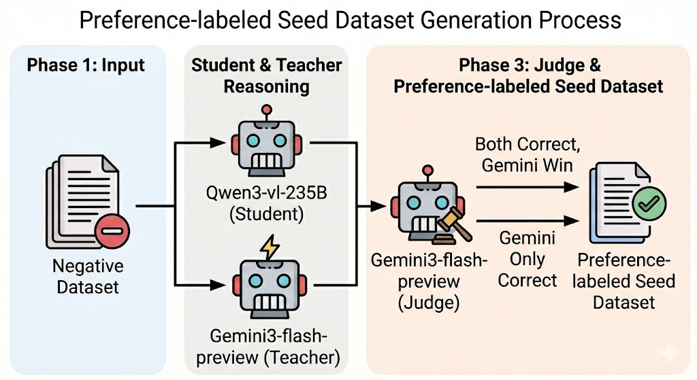

# Hard-Negative Preference Dataset Generator with Hydra

본 파이프라인은 **Qwen3-vl-235B가 반복적으로 오답을 생성한 고난도 문제(Hard-Negative)**를 대상으로,
**Gemini3-flash-preview의 우수한 추론 경로를 증류(Reasoning Distillation)**하기 위한
**Preference-labeled Seed Dataset**을 생성하는 것을 목표로 한다.

---

## 핵심 아이디어

* 단순히 정답 여부가 아닌, **추론 품질의 우위**를 기준으로 학습 데이터를 선별
* Gemini3-flash-preview를 **Teacher 모델이자 LLM-as-a-Judge**로 동시에 활용
* Qwen3-vl-235B가 실패한 문제만을 사용하여 **학습 신호의 밀도**를 극대화

---

## 데이터 생성 파이프라인

1. **Hard-Negative 문제 선별**

   * 기존 평가 결과에서 Qwen3-vl-235B가 오답을 낸 문제만을 추출
   * 이미 모델이 취약함을 보인 고난도 문항에만 집중

2. **Dual Solving (Gemini / Qwen)**

   * 동일한 Hard-Negative 문제를

     * Gemini3-flash-preview
     * Qwen3-vl-235B
       두 모델이 각각 독립적으로 풀이

3. **LLM-as-a-Judge 평가 (Gemini)**

   * Gemini3-flash-preview가 두 모델의 응답을 다시 평가
   * 정답 여부뿐 아니라 **추론의 논리성, 일관성, 근거 사용의 적절성**을 기준으로 비교

4. **Preference 데이터 선별**

   * 아래 두 조건 중 하나를 만족하는 경우만 Seed Dataset으로 채택

---

## Preference 샘플 채택 기준

생성된 데이터셋은 다음 두 유형의 샘플만 포함한다.

### 1. A_Correct

* **Gemini3-flash-preview만 정답**
* Qwen3-vl-235B는 오답
* 구성:

  * `chosen`: Gemini 응답
  * `rejected`: Qwen 응답

### 2. Both_Correct_Judge_A

* 두 모델 모두 정답
* 그러나 **LLM-as-a-Judge(Gemini)** 평가 결과
  Gemini의 추론이 더 우수하다고 판단된 경우
* 구성:

  * `chosen`: Gemini 응답
  * `rejected`: Qwen 응답

---

## 정리

즉, 본 파이프라인은

* 이미 **고난도로 검증된 문제**에 대해
* **Gemini와 Qwen을 모두 풀게 한 뒤**,
* **Gemini를 Judge로 활용하여**

  * *Gemini만 맞았거나*
  * *둘 다 맞았지만 Gemini의 추론이 더 나은 경우*만
    최종적으로 **Reasoning Distillation용 Preference Seed Data**로 축적한다.

이는 단순 정답 모방이 아니라,
**Qwen3-vl-235B의 잘못된 추론 경로를 명시적으로 교정**하는 것을 목표로 한 설계이다.

## 프로젝트 구조
```
.
├── configs/                    # Hydra 설정 파일
│   ├── config.yaml            # 메인 설정
│   ├── model/                 # 모델 설정
│   │   └── default.yaml
│   └── data/                  # 데이터 설정
│       └── default.yaml
├── src/                       # 소스 코드
│   ├── models/               # 모델 관련 코드
│   │   ├── llm_client.py    # LLM API 클라이언트
│   │   └── dpo_generator.py # DPO 생성 파이프라인
│   └── utils/                # 유틸리티 함수
│       ├── text_processing.py
│       └── prompts.py
├── outputs/                   # 출력 디렉토리 (자동 생성)
├── data/                      # 입력 데이터
├── main.py                    # 메인 실행 스크립트
└── requirements.txt           # 의존성 패키지
```


## 빠른 시작

### 1. 설치

```bash
pip install -r requirements.txt
```

### 2. 환경 설정

API 키를 .env에 작성

```bash
OLLAMA_API_KEY="your-api-key-here"
```

### 3. 데이터 준비

입력 데이터를 `data/` 디렉토리에 배치:

```
data/filtered_eco_hr_kr_df.csv
```

### 4. 실행

기본 설정으로 실행:

```bash
python main.py
```

특정 설정 오버라이드:

```bash
python main.py model.model_a.temperature=0.8 processing.sleep_interval=2.0
```

다른 모델 설정 사용:

```bash
python main.py model=custom_model
```

## 설정 가이드

### 메인 설정 (`configs/config.yaml`)

```yaml
data:
  input_path: "data/filtered_eco_hr_kr_df.csv"
  output_path: "outputs/cot_dpo_dataset.jsonl"

api:
  base_url: "https://ollama.com/v1/"
  timeout: 200.0

processing:
  sleep_interval: 1.0  # API 호출 간격 (초)
  
strategy:
  use_judge: true  # 두 답이 모두 맞을 때 심판 사용
  filter_strategies:  # 최종 필터링할 전략
    - "Both_Correct_Judge_A"
    - "A_Correct"
```

### 모델 설정 (`configs/model/default.yaml`)

```yaml
model_a:
  name: "gemini-3-flash-preview:cloud"
  temperature: 1.0
  max_tokens: 16382

model_b:
  name: "qwen3-vl:235b-instruct-cloud"
  temperature: 0.6
  max_tokens: 16382
  extra_body:
    topk: 20
    presence_penalty: 1.6
```

## 출력 형식

```json
{
  "prompt": "문제 텍스트...",
  "chosen": "선택된 답변 (추론 + 정답)...",
  "rejected": "거부된 답변 (추론 + 오답)...",
  "gold": 3,
  "strategy": "A_Correct"
}
```
